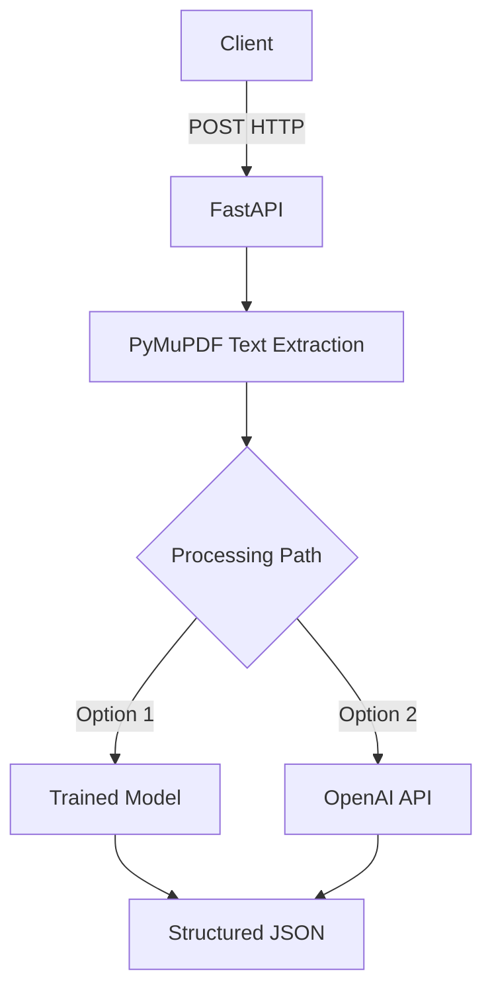
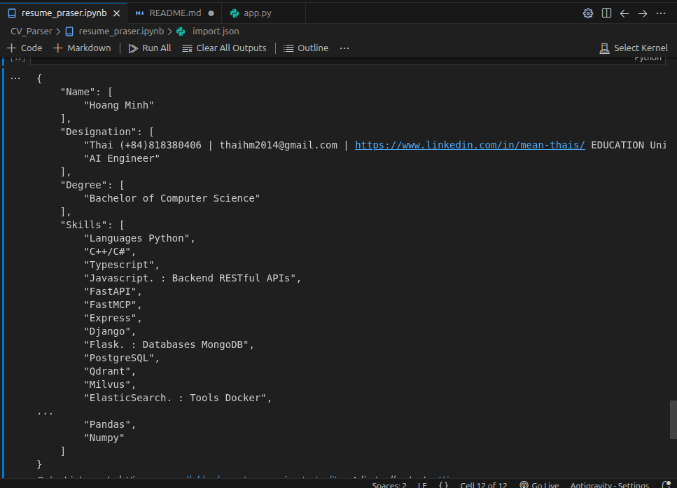
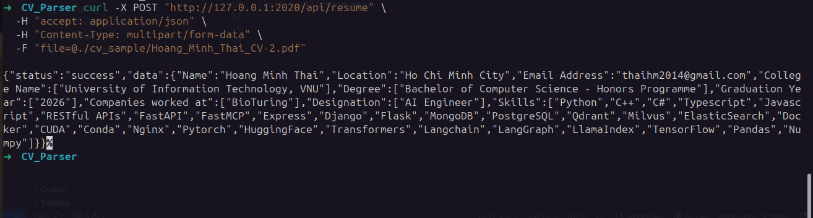

```mermaid
graph TD
    A[Client] -->|POST HTTP| B[FastAPI]
    B --> C[PyMuPDF Text Extraction]
    C --> D{Processing Path}
    D -->|Option 1| E[Trained Model]
    D -->|Option 2| F[OpenAI API]
    E --> G[Structured JSON]
    F --> G[Structured JSON]
```

## Finetuning to classify text
https://huggingface.co/ducnv123/resume-praser/

## Demo

1. Using finetune model

2. Using OpenAI API

